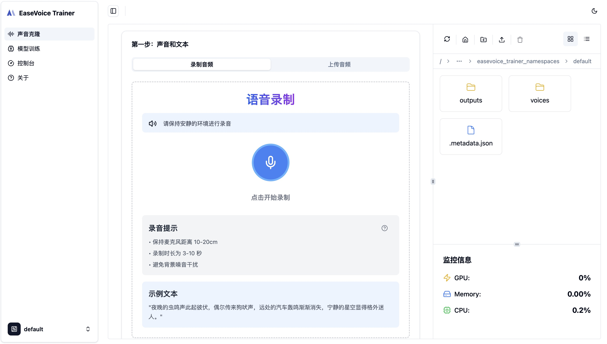
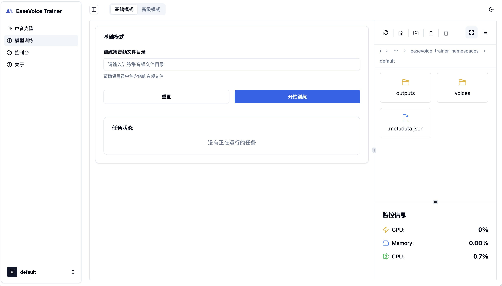
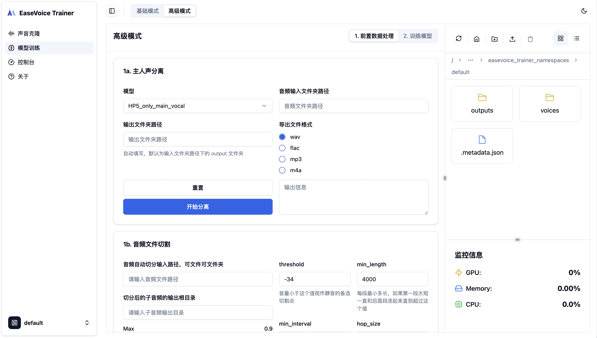

# EaseVoice Trainer Portal

[](https://opensource.org/licenses/Apache-2.0)
[](./README.zh-CN.md)

The EaseVoice Trainer Portal is the front-end interface for EaseVoice Trainer and is designed to provide an intuitive and easy-to-use user interface for sound synthesis and conversion. This front-end project works in conjunction with the back-end of [EaseVoice Trainer](https://github.com/megaease/easevoice-trainer) to make advanced sound cloning technology easy to users of all technology levels.

> 🔗 **Backend Repository:** [EaseVoice Trainer Backend](https://github.com/megaease/easevoice-trainer)

## ✨ Features

- 🎙️ Voice Cloning - Clone voices with high quality and natural sound
- 🔊 Audio Processing - Record, upload and process audio files
- 📊 Waveform Visualization - Visualize audio waveforms in real-time
- 🤖 Model Training - Train and fine-tune AI voice models
- ☁️ Cloud Storage - Manage your audio files and models in the cloud
- 📝 Data Annotation - Annotate and manage training data

## 📸 Screenshots

<div align="center">
  
  
  
  
  
</div>

## 🛠️ Tech Stack

- [React 18](https://react.dev/) - A JavaScript library for building user interfaces
- [TypeScript](https://www.typescriptlang.org/) - JavaScript with syntax for types
- [Vite](https://vitejs.dev/) - Next generation frontend tooling
- [Tailwind CSS](https://tailwindcss.com/) - A utility-first CSS framework
- [Shadcn/ui](https://ui.shadcn.com/) - Beautifully designed components
- [@tanStack/react-query](https://tanstack.com/query/latest) - Powerful data synchronization
- [@tanStack/react-router](https://tanstack.com/router/latest) - Modern routing solution

## 🚀 Getting Started

1. Install dependencies:

```bash
pnpm install
```

2. Create a development environment configuration file:

```bash
echo "VITE_API_BASE_URL=http://localhost:8000/apis/v1" > .env.development
```

3. Start the development server:

```bash
pnpm dev
```

4. Build for production:

```bash
pnpm build
```

## 📄 License

EaseVoice Trainer Portal is open-sourced under the Apache 2.0 License. See the [LICENSE](./LICENSE) file for details.
