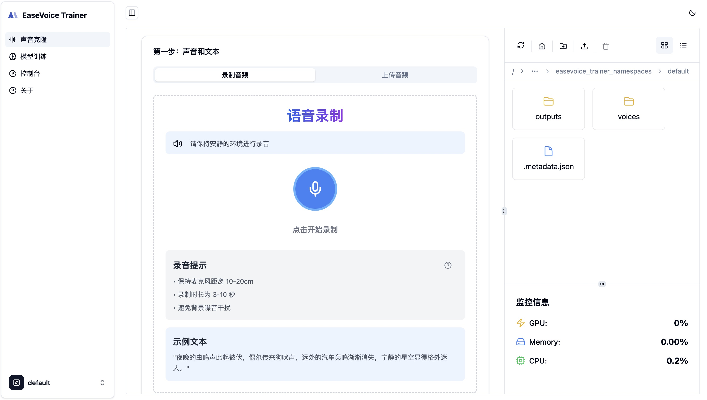
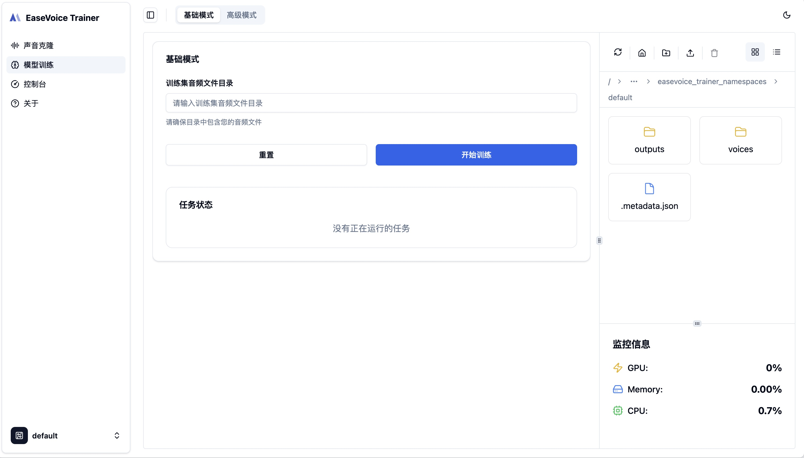
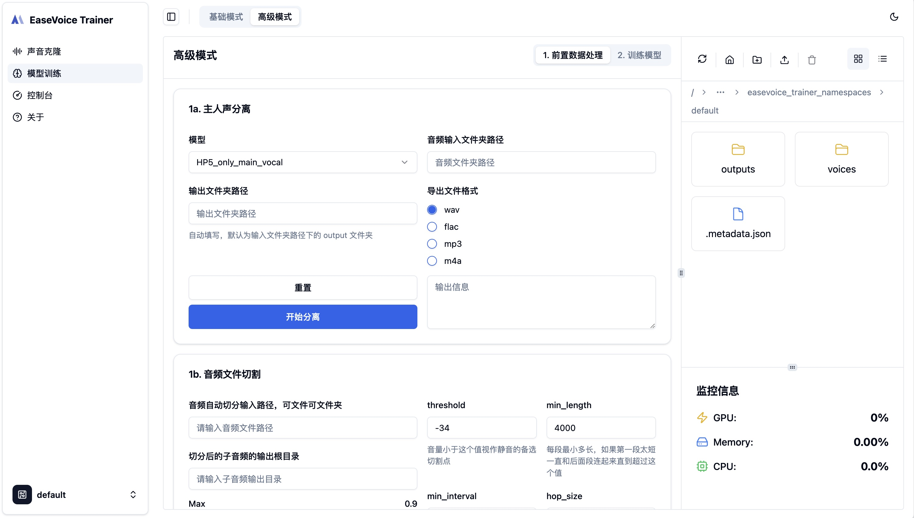

# EaseVoice 训练平台

[](https://github.com/megaease/easevoice-trainer-portal)
[](https://opensource.org/licenses/Apache-2.0)
[](./README.md)

EaseVoice Trainer Portal 是 EaseVoice Trainer 的前端界面，旨在为声音合成和转换提供直观、易用的用户界面。这个前端项目与 [EaseVoice Trainer](https://github.com/megaease/easevoice-trainer) 后端协同工作，使先进的声音克隆技术对各种技术水平的用户都能轻松上手。

> 🔗 **后端项目地址：** [EaseVoice Trainer 后端](https://github.com/megaease/easevoice-trainer)

## ✨ 功能特性

- 🎙️ 声音克隆 - 高质量、自然的声音克隆
- 🔊 音频处理 - 录制、上传和处理音频文件
- 📊 波形可视化 - 实时音频波形显示
- 🤖 模型训练 - AI 声音模型训练和微调
- ☁️ 云端存储 - 云端音频和模型管理
- 📝 数据标注 - 训练数据标注和管理

## 📸 界面预览

<div align="center">
  
  
  

  
</div>

## 🛠️ 技术栈

- [React 18](https://react.dev/) - 用于构建用户界面的 JavaScript 库
- [TypeScript](https://www.typescriptlang.org/) - 带类型语法的 JavaScript
- [Vite](https://vitejs.dev/) - 新一代前端构建工具
- [Tailwind CSS](https://tailwindcss.com/) - 实用优先的 CSS 框架
- [Shadcn/ui](https://ui.shadcn.com/) - 精美设计的组件库
- [@tanStack/react-query](https://tanstack.com/query/latest) - 强大的数据同步方案
- [@tanStack/react-router](https://tanstack.com/router/latest) - 现代化路由解决方案

## 🚀 快速开始

1. 安装依赖：
```bash
pnpm install
```

2. 创建开发环境配置文件：
```bash
echo "VITE_API_BASE_URL=http://localhost:8000/apis/v1" > .env.development
```

3. 启动开发服务器：
```bash
pnpm dev
```

4. 构建生产版本：
```bash
pnpm build
```

## 📄 许可证

EaseVoice 训练平台基于 Apache 2.0 许可证开源。详细信息请查看 [LICENSE](./LICENSE) 文件。